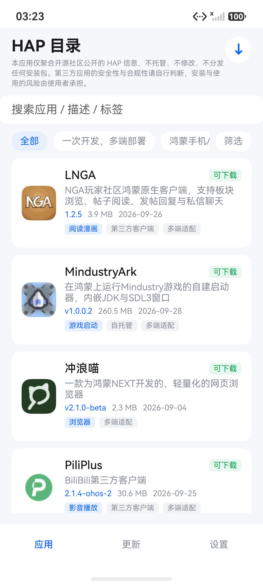
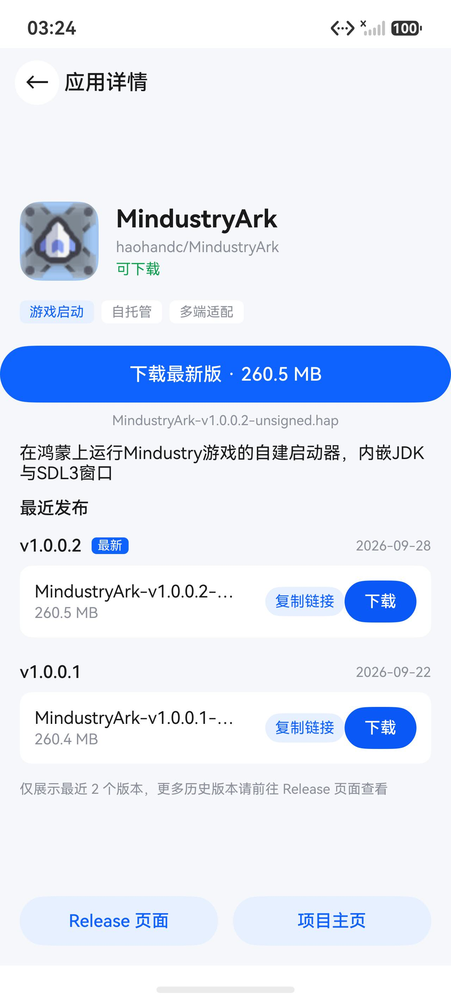
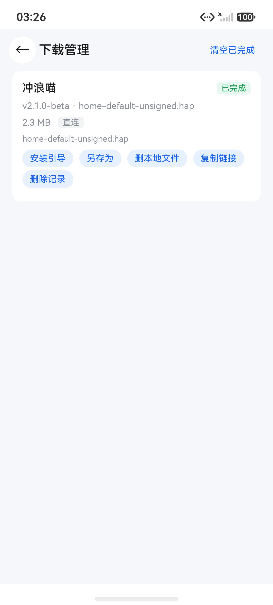
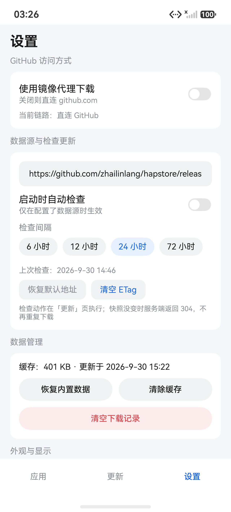

# HapStore

鸿蒙（HarmonyOS）未上架 HAP 的聚合目录 App。

鸿蒙生态里有大批优秀的第三方应用没有上架应用市场，只散落在各自 GitHub 仓库的 Release 里 ——
要装得先知道它存在、再翻到 Release 页、再在几十个资产里找到对的那一个 `.hap`。
HapStore 把这件事收拢成一份目录：目前收录 **87 个**应用，其中 **68 个**当前有可下载的 HAP。
装完打开就能浏览、搜索、下载，不联网也能用。
国内直连 GitHub 慢或连不上时，可切换内置的公开镜像代理（默认关闭，下载失败也会自动换链路重试）。

**本仓库不托管、不修改、不重签名任何 HAP 文件。** 所有下载直链都指向各上游项目的官方 Release。

> 🙏 **数据来自 [Zitann/HarmonyOS-Haps](https://github.com/Zitann/HarmonyOS-Haps)。**
> 这份社区清单是这个 App 的地基 —— 87 个应用的仓库坐标、分类与简介全部来自它，由作者和社区长期逐条维护。
> HapStore 只是把它做成了手机上能逛、能搜、能下载的样子，所有基础性工作的功劳归于上游。

---

## 功能亮点

**📦 开箱即用，离线能逛**
包里内置了一份完整快照（529KB），首次打开就有全部 87 个应用 —— 图标、描述、版本号、更新时间全在本地，
断网也能翻。联网后点「检查更新」拉最新，没变化时服务端回 304，不会重复下载。

**🔍 四维筛选 + 全字段搜索**
- 分类切换：一次开发多端部署 43 / 鸿蒙手机平板 38 / 鸿蒙电脑 6
- 功能类型 10 种：影音播放、网络代理、社区社交、阅读漫画、游戏启动、开发工具、效率工具、浏览器、系统工具、其他
- 可运行设备：手机 / 平板 / 电脑（多选，命中任一）
- 属性标签：多端适配 / 第三方客户端 / 自托管 / Flutter（多选）
- 搜索覆盖名称、描述、仓库名、分类、标签、设备类型，输入即筛
- 筛选按钮上带生效条件数量角标，底部实时显示「查看 N 个应用」

**⬇️ 下载不脏目录**
先下到沙箱的 `.part` 临时文件 → 校验大小 → 才改名写进你选的目录。中途取消不会在目标位置留下残缺文件。
按应用名自动建子文件夹防撞名，文件名自动补版本号（`entry-default.hap` → `entry-default-1.2.5.hap`），
重名自动加后缀，覆盖前弹确认。

**🚦 完整的下载管理**
暂停 / 继续 / 取消 / 重试 / 另存为 / 删本地副本 / 复制链接，全都有。
每条记录显示状态、百分比、进度条、体积、走的是直连还是镜像；失败时给出错误说明和实际使用的 URL。
100 条记录跨会话保留，App 重启后还在。

**🌐 链路可换可测**
国内直连 GitHub 慢的话，内置 ghfast.top、ghproxy.net 等镜像。
设置页一键测速，用真实的 HAP 直链探测，列出每条链路的毫秒数，点一下就切换。
下载失败还会自动换另一条链路再试一次。默认直连，镜像开关在你手上。

**🔄 版本变化一目了然**
「更新」Tab 直接告诉你：新增了哪几个应用、哪几个从 `1.2.4` 升到了 `1.2.5`、你下载过的应用有没有出新版本。
另有最近更新时间线（20 条）。确认后点「应用更新」才写进本地，不会偷偷改你的数据。

**🧭 安装引导手把手**
鸿蒙不允许第三方应用静默安装，最后一步必须你在系统安装器上确认一次。
所以下载完会弹出三步图文引导（开发者模式 → 本地安装 → 选文件），
另附 hdc 命令和无线调试两条备选路径，并提醒侧载签名的有效期。

**🎨 跟随系统深浅色，两种列表密度**
浅色 / 深色 / 跟随系统，即时生效；列表可选舒适或紧凑。

**🔒 干净**
只申请 `INTERNET` 和 `GET_NETWORK_INFO` 两个权限，无埋点、无账号、无第三方 SDK，
设置和下载记录全存 App 私有目录，不上传任何数据。

---

## 界面

| 应用列表 | 详情与下载 |
|---|---|
|  |  |

| 下载管理 | 设置 |
|---|---|
|  |  |

---

## 下载安装

最新 HAP 在 [Releases](https://github.com/zhailinlang/hapstore/releases/latest) 里，每个版本两个文件：

| 文件 | 用途 |
|---|---|
| `HapStore-vX.Y.Z-signed.hap` | 签名版，**绝大多数人下这个**，可直接安装 |
| `HapStore-vX.Y.Z-unsigned.hap` | 未签名版，供你用自己的证书重签后安装 |

```bash
hdc install HapStore-v1.0.0-signed.hap
```

未签名版**装不上真机** —— 鸿蒙要求 HAP 必须签名，它只在你不想用本项目证书时才有意义。

装完打开就能用，无需联网、无需注册。新数据靠「更新」Tab 里的「检查更新」手动拉取
（也可以在设置里打开启动自动检查）。

---

## 常见问题

**为什么不能像应用商店那样点一下就装完？**
鸿蒙不允许第三方应用静默安装 —— 安装权限是系统级的，普通应用拿不到。
所以这个 App 的定位是「发现 → 下载 → 交给系统安装器」：你点安装后跳到系统确认页，手动确认一次即可。
未上架 ≠ 装不了，只是多一步。

**为什么有些应用显示「暂无 Release」或「Release 中无 HAP」？**
收录 87 个应用里当前有 68 个能下载。其余是上游仓库还没发 Release，或 Release 里没附 `.hap` 包。
这类会在列表卡片上标出状态，不会让你白点。

**数据多久更新一次？我要手动更新吗？**
快照每天自动更新两次（GitHub Actions，北京时间 12:23 / 00:23）。
App 不会自动拉，需要你在「更新」Tab 点「检查更新」—— 也可以在设置里打开启动时自动检查，或选 6/12/24/72 小时的检查间隔。

**下载慢怎么办？**
设置页有镜像测速：点一下测速按钮，看哪条链路毫秒数最低就选哪条。
建议先试 ghfast.top。下载失败时 App 会自动换直连再试一次。

**侧载的应用能用多久？**
取决于签名有效期：未实名开发者约 14 天，实名约 180 天，到期需要重新安装。这是鸿蒙的规则，与本 App 无关。

**它会收集我的数据吗？**
不会。只申请网络和获取网络状态两个权限，无埋点、无账号、无第三方 SDK，
所有数据存在 App 私有目录里。

**我想推荐一个应用 / 发现某个信息错了，该去哪儿提？**
清单本身（应用名称、仓库坐标、分类、简介）归上游
[Zitann/HarmonyOS-Haps](https://github.com/Zitann/HarmonyOS-Haps) 管 ——
去那儿提 issue 或 PR 最直接，我们每天同步两次，第二天就会跟上。
如果是 HAP 下载链接失效、打标分类不准这类「HapStore 这一层」的问题，欢迎在本仓库提 issue。

---

## 致谢

**[Zitann/HarmonyOS-Haps](https://github.com/Zitann/HarmonyOS-Haps)** —— 本项目全部应用清单的来源，
也是这个项目能够成立的前提。

它没有做成一个 App，而是用一份朴素的 `apps.yaml` 把散落在 GitHub 各处的鸿蒙未上架 HAP 逐条整理出来，
并长期维护至今。没有这份基础性工作，就不会有 HapStore。
特此致谢，也请去给上游点个 ⭐ —— 它值得。

HapStore 在其中承担的部分很有限，分工如下：

| 环节 | 谁在做 |
|---|---|
| 应用清单（87 个仓库坐标、分类、简介） | **[Zitann/HarmonyOS-Haps](https://github.com/Zitann/HarmonyOS-Haps)** |
| Release 里 `.hap` 直链的探测、图标抓取、功能/设备打标、快照分发 | HapStore（本仓库） |
| HAP 文件本身 | 各应用原作者 —— 我们不托管、不修改、不重签名，直链一律指向其官方 Release |

上游仓库目前未声明开源许可证，清单内容的许可与署名以其仓库说明为准。
本仓库自身代码为 MIT，见 [LICENSE](LICENSE)。

---

## 免责声明

- 本仓库**不包含任何 HAP 文件**。App 里所有的下载直链都指向各上游项目的官方 Release。
- 本App使用 Workbuddy Vibe Coding而来，本人自测运行正常，当然也可能存在不少bug，如果有使用问题可以提issue。
- 各应用的版权与责任归其原作者。发现侵权内容请提 issue，会尽快下架索引。
- App 不收集、不上传任何用户数据，全部逻辑在本地完成。
- 应用清单来源 [Zitann/HarmonyOS-Haps](https://github.com/Zitann/HarmonyOS-Haps)，致谢见上文。

---

## 许可

代码 MIT，见 [LICENSE](LICENSE)。

应用清单来自 [Zitann/HarmonyOS-Haps](https://github.com/Zitann/HarmonyOS-Haps)，
其许可与署名以原仓库说明为准。

构建、发版与快照自动化的维护笔记见 [DEVELOP.md](DEVELOP.md)。
